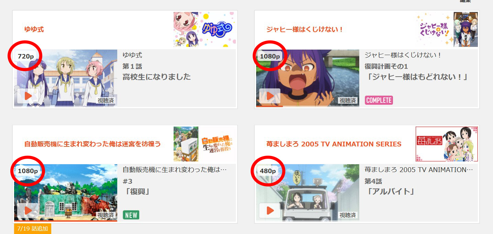
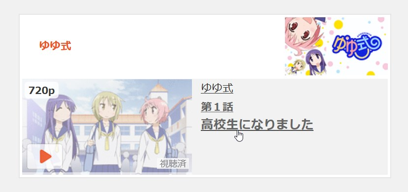
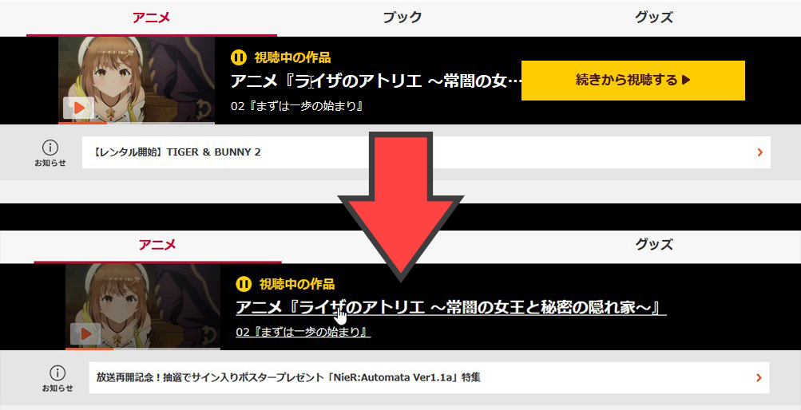

# dアニメストアPlus
dアニメストアで使用できるUserScriptです。  
[ダウンロード](https://greasyfork.org/scripts/471042-d%E3%82%A2%E3%83%8B%E3%83%A1%E3%82%B9%E3%83%88%E3%82%A2plus/code/d%E3%82%A2%E3%83%8B%E3%83%A1%E3%82%B9%E3%83%88%E3%82%A2Plus.user.js)  

# 主な機能
・動画をウィンドウではなく新規タブで開く  
・動画の音量マウスホイールで操作可能  
・サムネイルに動画の解像度を表示(480p、720p、1080p)  
 
他にも細かい機能多数..

# スクリーンショット
### サムネイルに解像度を表示  
  
### サムネイルとタイトル、どちらをクリックしても動画再生可能
  
### トップページの「視聴中の作品」のタイトルをすべて表示
  

# クレジット
このUserScriptは家守カホウ様の[dアニメストア便利化](https://greasyfork.org/ja/scripts/414008)のコードを一部使用しています
